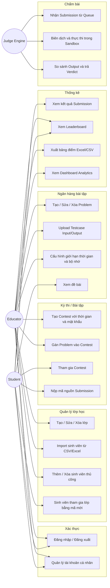
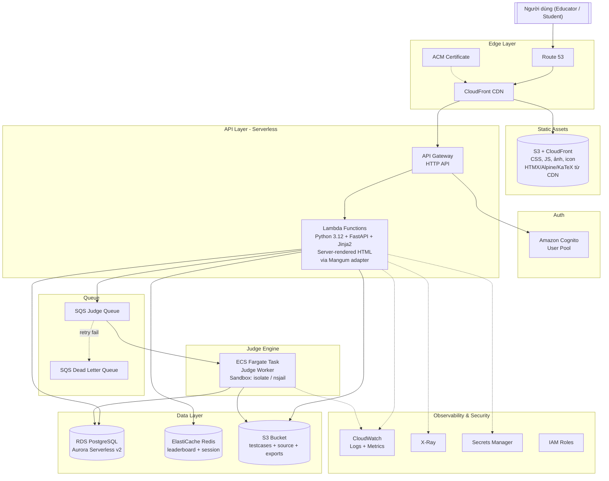
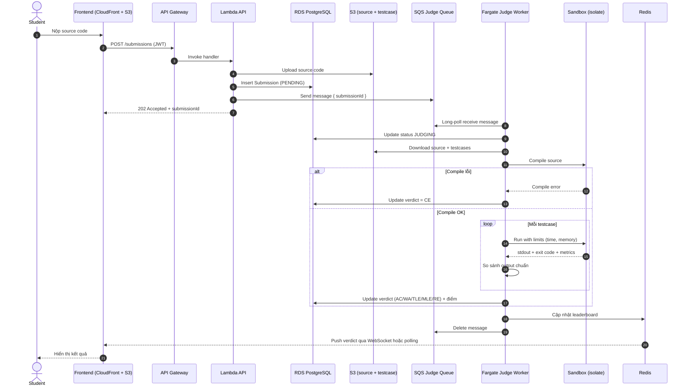
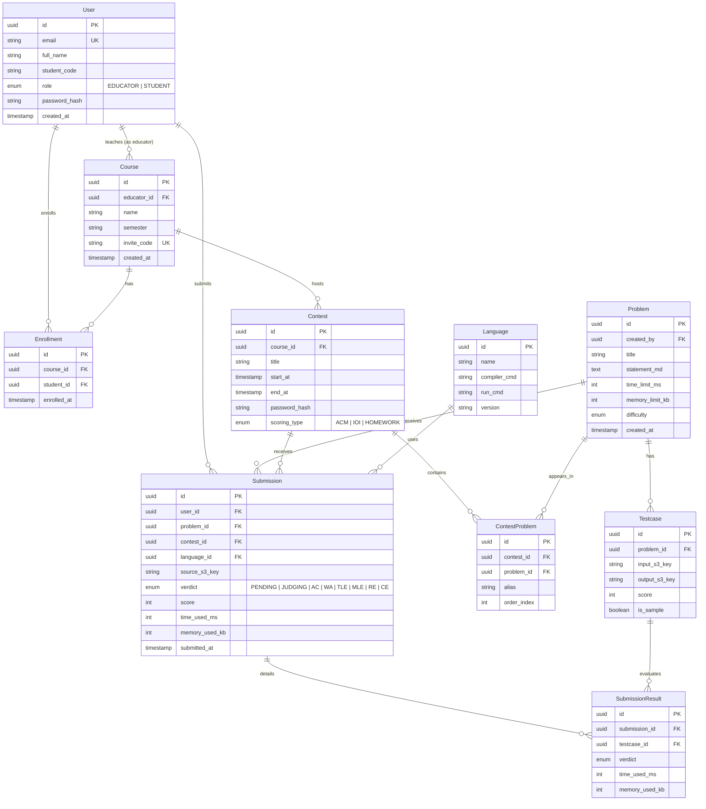
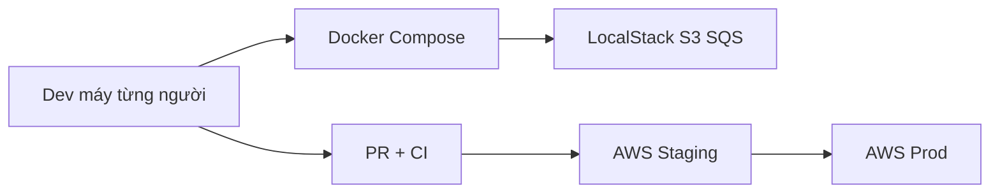

# HCMUTE.OnlineJudge

> Nền tảng Online Judge hướng giáo dục dành cho câu lạc bộ học thuật / khoa / trường đại học, triển khai trên AWS theo hướng serverless-first.

---

## Mục lục

1. [Giới thiệu](#1-giới-thiệu)
2. [Mục tiêu dự án](#2-mục-tiêu-dự-án)
3. [Phạm vi (Scope)](#3-phạm-vi-scope)
4. [Tác nhân (Actors)](#4-tác-nhân-actors)
5. [Use Case Diagram](#5-use-case-diagram)
6. [Danh sách Use Case chi tiết](#6-danh-sách-use-case-chi-tiết)
7. [Danh sách tính năng (Feature List)](#7-danh-sách-tính-năng-feature-list)
8. [Kiến trúc hệ thống trên AWS](#8-kiến-trúc-hệ-thống-trên-aws)
9. [Luồng chấm bài (Judging Flow)](#9-luồng-chấm-bài-judging-flow)
10. [ERD sơ bộ](#10-erd-sơ-bộ)
11. [Công nghệ dự kiến (Tech Stack)](#11-công-nghệ-dự-kiến-tech-stack)
12. [Roadmap phát triển](#12-roadmap-phát-triển)
13. [Cấu trúc thư mục dự kiến](#13-cấu-trúc-thư-mục-dự-kiến)
14. [Hướng dẫn khởi tạo local](#14-hướng-dẫn-khởi-tạo-local)
15. [Quy trình phát triển, môi trường chung & teamwork](#15-quy-trình-phát-triển-môi-trường-chung--teamwork)
16. [Đóng gói & Deploy](#16-đóng-gói--deploy)

---

## 1. Giới thiệu

**HCMUTE.OnlineJudge** là hệ thống chấm bài lập trình trực tuyến (Online Judge) được xây dựng cho môi trường **giáo dục** — phục vụ các câu lạc bộ học thuật, lớp học lập trình, và các kỳ thi nội bộ trong trường đại học.

Khác với các OJ thi đấu chuyên nghiệp (Codeforces, AtCoder), dự án này tập trung vào **quản lý lớp học**, **theo dõi tiến độ học tập của sinh viên** và **xuất bảng điểm cho giảng viên**. Sinh viên nộp mã nguồn, hệ thống tự động biên dịch + thực thi trong sandbox an toàn, trả về kết quả (verdict) và cập nhật bảng xếp hạng theo thời gian thực.

---

## 2. Mục tiêu dự án

- Cung cấp môi trường luyện tập lập trình tự động hóa cho sinh viên.
- Giúp giảng viên / ban chủ nhiệm CLB ra đề, quản lý lớp, tổ chức kỳ thi và xuất bảng điểm một cách có hệ thống.
- Đảm bảo chấm bài **nhanh, an toàn, công bằng** thông qua sandbox cách ly.
- Dễ mở rộng theo số lượng submission nhờ kiến trúc **serverless + queue-based** trên AWS.
- Có thể triển khai miễn phí / chi phí thấp ở quy mô CLB, nhưng vẫn scale được khi dùng toàn khoa.

---

## 3. Phạm vi (Scope)

### In-scope (nằm trong phạm vi phiên bản đầu)

- Quản lý người dùng (giảng viên, sinh viên) với xác thực bằng email/tài khoản CLB.
- Quản lý lớp học (course/class) và kỳ thi (contest/assignment).
- Quản lý ngân hàng bài tập (problem) kèm testcase.
- Nộp bài, chấm tự động với nhiều ngôn ngữ (C/C++, Java, Python tối thiểu).
- Bảng xếp hạng (leaderboard) và xuất bảng điểm ra Excel/CSV.
- Kiến trúc serverless trên AWS, CI/CD tự động.

### Out-of-scope (không làm trong giai đoạn này)

- Tổ chức thi đấu đội nhóm theo luật ICPC/IOI.
- Thanh toán / tính phí người dùng.
- Livestream / video bài giảng tích hợp.
- Mobile app native (chỉ làm web responsive).
- Chấm bài tương tác (interactive judge) và special judge phức tạp ở phiên bản đầu.

---

## 4. Tác nhân (Actors)

Hệ thống gồm **3 actor** chính:

### 4.1. Educator (Giảng viên / Ban chủ nhiệm CLB)

Người có quyền quản trị cao nhất trong phạm vi lớp học của mình. Ở phiên bản đầu, Educator gộp luôn vai trò System Admin (phân quyền, cấu hình hệ thống).

**Trách nhiệm:**
- Tạo và quản lý lớp học, sinh viên, bài tập, kỳ thi.
- Chấm/duyệt kết quả, xuất bảng điểm.
- Cấu hình hệ thống, quản lý ngôn ngữ lập trình được hỗ trợ.

### 4.2. Student (Sinh viên / Thí sinh)

Người dùng chính của hệ thống — tham gia lớp học, luyện tập và dự thi.

**Trách nhiệm:**
- Tham gia lớp học theo mã lớp hoặc được Educator thêm.
- Đọc đề, nộp code, xem kết quả và bảng xếp hạng.

### 4.3. Judge Engine (Hệ thống chấm bài tự động)

Actor phi người dùng — là tập hợp các worker chạy nền trong sandbox để chấm bài.

**Trách nhiệm:**
- Lấy submission từ hàng đợi (SQS).
- Biên dịch, thực thi mã nguồn trong sandbox an toàn.
- So sánh output với đáp án, trả verdict và điểm số về database.

---

## 5. Use Case Diagram



---

## 6. Danh sách Use Case chi tiết

### UC-01: Đăng nhập

- **Actor**: Educator, Student
- **Tiền điều kiện**: Tài khoản đã được tạo / cấp bởi hệ thống.
- **Luồng chính**: Nhập email + mật khẩu → xác thực qua Amazon Cognito → nhận JWT token.
- **Hậu điều kiện**: Session được khởi tạo, điều hướng đến dashboard theo role.

### UC-10: Tạo / Sửa / Xóa lớp học

- **Actor**: Educator
- **Tiền điều kiện**: Đã đăng nhập với role Educator.
- **Luồng chính**: Nhập tên lớp, mô tả, học kỳ → hệ thống sinh mã mời (invite code) ngẫu nhiên.
- **Hậu điều kiện**: Lớp được tạo, Educator là chủ sở hữu; sinh viên có thể join bằng mã mời.

### UC-11: Import sinh viên từ CSV/Excel

- **Actor**: Educator
- **Tiền điều kiện**: File CSV/Excel có cột `mssv, email, họ tên`.
- **Luồng chính**: Upload file → server validate → tạo account (nếu chưa có) và enroll vào lớp.
- **Ngoại lệ**: Email trùng → bỏ qua dòng đó và log ra báo cáo lỗi.

### UC-20: Tạo / Sửa / Xóa Problem

- **Actor**: Educator
- **Luồng chính**: Nhập đề bài (Markdown), chọn ngôn ngữ cho phép, giới hạn time/memory, upload testcase.
- **Hậu điều kiện**: Problem sẵn sàng để gán vào Contest.

### UC-21: Upload Testcase

- **Actor**: Educator
- **Luồng chính**: Upload nhiều cặp file `input.txt` / `output.txt` (hoặc zip) → lưu vào S3, metadata lưu RDS.
- **Hậu điều kiện**: Testcase gắn với Problem, dùng để chấm tự động.

### UC-30: Tạo Contest

- **Actor**: Educator
- **Tham số**: Thời gian bắt đầu/kết thúc, mật khẩu (tùy chọn), kiểu chấm (ACM / IOI / bài tập thường), phạt thời gian.
- **Hậu điều kiện**: Contest xuất hiện trong danh sách, sinh viên trong lớp có thể thấy.

### UC-33: Nộp Submission

- **Actor**: Student
- **Tiền điều kiện**: Đã tham gia Contest, Contest đang diễn ra.
- **Luồng chính**: Chọn ngôn ngữ + paste code (hoặc upload file) → API lưu submission vào RDS, upload source lên S3, đẩy message vào SQS.
- **Hậu điều kiện**: Submission ở trạng thái `PENDING`, chờ Judge chấm.

### UC-40 → UC-42: Chấm bài tự động

- **Actor**: Judge Engine
- **Luồng**: Pull message SQS → download source và testcase từ S3 → compile trong sandbox → chạy từng testcase với giới hạn time/memory → so sánh output → update verdict + điểm vào RDS → gửi notification (WebSocket / polling).

### UC-51: Xem Leaderboard

- **Actor**: Educator, Student
- **Luồng**: Query leaderboard realtime (cache Redis) theo Contest, hiển thị thứ hạng + thời gian + số bài AC.

### UC-52: Xuất bảng điểm

- **Actor**: Educator
- **Luồng**: Chọn lớp/contest → hệ thống render file Excel/CSV → download.

### UC-53: Dashboard Analytics (Nice-to-have)

- **Actor**: Educator
- **Luồng**: Xem biểu đồ tỷ lệ AC/WA, phân bố điểm, sinh viên chưa hoàn thành bài, top submission nhiều nhất.

---

## 7. Danh sách tính năng (Feature List)

### 7.1. Must-have

- [x] **Xác thực & phân quyền**: Cognito, 2 role (Educator / Student), JWT, quên mật khẩu.
- [x] **Quản lý lớp học**: CRUD class, invite code, import CSV/Excel.
- [x] **Ngân hàng bài tập**: CRUD problem, upload testcase (zip/multi-file), Markdown editor cho đề bài.
- [x] **Ngôn ngữ hỗ trợ (tối thiểu)**: C, C++, Java, Python 3.
- [x] **Kỳ thi / Bài tập**: CRUD contest, mật khẩu, thời gian bắt đầu/kết thúc, scoring ACM / IOI / homework.
- [x] **Nộp bài & chấm tự động**: sandbox cách ly, giới hạn time/memory, verdict đầy đủ (AC, WA, TLE, MLE, RE, CE, PE).
- [x] **Leaderboard**: realtime theo contest, cached.
- [x] **Xuất điểm**: Excel/CSV theo lớp & contest.
- [x] **Logging & monitoring**: CloudWatch Logs, error tracking.

### 7.2. Nice-to-have (giai đoạn sau)

- [ ] **Phát hiện đạo văn (Plagiarism Detection)**: thuật toán kiểu MOSS/winnowing, so sánh cross-submission trong contest.
- [ ] **Editorial / Lời giải**: Educator viết editorial cho problem, Student xem sau khi AC hoặc sau khi contest kết thúc.
- [ ] **Achievements / Badges / Gamification**: huy hiệu "First Solve", streak, rank theo điểm lũy kế.
- [ ] **Learning Analytics Dashboard**: biểu đồ tiến độ học tập theo tuần, heatmap hoạt động, gợi ý bài tập tiếp theo dựa trên năng lực.

---

## 8. Kiến trúc hệ thống trên AWS

Hệ thống thiết kế theo hướng **serverless-first** để tiết kiệm chi phí ở quy mô CLB và scale theo nhu cầu khi thi.



### 8.1. Vai trò từng dịch vụ

| Dịch vụ | Vai trò |
|---------|---------|
| **CloudFront** | CDN cache static asset + proxy API để giảm latency toàn cầu. |
| **Route 53** | Quản lý DNS cho domain (ví dụ `oj.hcmute.edu.vn`). |
| **ACM** | Cấp SSL/TLS miễn phí cho CloudFront. |
| **S3 (static assets)** | Host asset tĩnh của app (CSS build từ Tailwind CLI, icon, ảnh, favicon). HTMX/Alpine/KaTeX có thể load từ CDN công cộng hoặc self-host tại đây. |
| **Amazon Cognito** | Xác thực người dùng (User Pool, Hosted UI). Session cookie được FastAPI issue sau khi verify JWT Cognito. |
| **API Gateway (HTTP API)** | Endpoint công khai, chuyển mọi request (cả HTML page lẫn JSON API) về Lambda. |
| **AWS Lambda** | Render HTML qua **Jinja2 template** + xử lý business logic. Chạy **Python 3.12 + FastAPI**, đóng gói bằng [Mangum](https://mangum.fastapiexpert.com/) để kết nối API Gateway. HTMX request chỉ nhận về HTML partial để swap. |
| **RDS PostgreSQL (Aurora Serverless v2)** | Dữ liệu quan hệ chính: user, class, problem, submission, contest, score. |
| **ElastiCache Redis** | Cache leaderboard realtime, rate-limit, pub/sub notification. |
| **S3 (data bucket)** | Lưu testcase (input/output), source code submission, file import CSV, file export Excel. |
| **SQS** | Hàng đợi chấm bài (judge queue) — decoupling API và worker. |
| **SQS DLQ** | Chứa message chấm thất bại nhiều lần để điều tra. |
| **ECS Fargate** | Chạy Judge Worker dạng container Python có **sandbox** (`isolate` của IOI hoặc `nsjail`). Không dùng Lambda cho worker vì cần namespace/cgroup để giới hạn process. |
| **CloudWatch** | Logs, metrics, alarm (ví dụ SQS backlog, Lambda error rate). |
| **X-Ray** | Trace request xuyên suốt API → Lambda → DB. |
| **Secrets Manager** | Lưu DB password, JWT signing key, API key bên thứ 3. |
| **IAM** | Phân quyền tối thiểu (least privilege) cho Lambda, Fargate, S3, SQS. |

### 8.2. Vì sao không để Judge Worker chạy trên Lambda?

- Lambda không cho phép tạo namespace/cgroup để sandbox kernel-level.
- Lambda có giới hạn thời gian 15 phút và không cung cấp kernel isolation cần thiết cho `isolate`/`nsjail`.
- Fargate cho phép container chạy với quyền phù hợp, bật `/proc/self/oom_score_adj`, giới hạn CPU/memory chính xác, đồng thời vẫn serverless (không quản lý EC2).

---

## 9. Luồng chấm bài (Judging Flow)



**Giới hạn & bảo mật:**
- Sandbox `isolate` cô lập: chroot, cgroup (CPU, memory, process count), không có network.
- Timeout cứng: `time_limit * 2` để tránh worker treo.
- Worker chạy với user không đặc quyền, filesystem read-only ngoài thư mục `/tmp/work`.
- Nếu worker chết giữa chừng, submission được re-queue đến `max_receive_count = 3` rồi vào DLQ.

---

## 10. ERD sơ bộ



---

## 11. Công nghệ dự kiến (Tech Stack)

Triết lý: **Codeforces-style** — server-rendered HTML, không SPA, không bundler JS, không build step phức tạp. Mọi thứ đều nhẹ, load nhanh, dễ đóng góp cho thành viên mới của CLB (chỉ cần biết Python + HTML là code được).

**So sánh với Codeforces:**

| Codeforces dùng | Chúng ta dùng |
|-----------------|----------------|
| Java Servlet + template engine | **FastAPI + Jinja2** |
| jQuery cho AJAX | **HTMX** (kế vị hiện đại của jQuery, ~14KB) |
| JS nhỏ lẻ cho UI state | **Alpine.js** (~15KB, declarative) |
| CSS thủ công + Bootstrap-ish | **Tailwind CSS (CDN)** — không cần bundler |
| MathJax | **KaTeX** (nhanh hơn MathJax) |
| (Syntax highlight) | **Prism.js** cho code block trên đề bài / submission |

**Bảng tech stack đầy đủ:**

| Layer | Lựa chọn chính | Ghi chú |
|-------|---------------|---------|
| **Frontend template** | **Jinja2** (built-in FastAPI) | Server-rendered HTML. Không có bundler, không có build step. |
| **Interactivity** | **HTMX** + **Alpine.js** | HTMX cho AJAX/partial update (submit form → swap HTML), Alpine cho dropdown/tab/modal client-side. |
| **CSS** | **Tailwind CSS qua CDN** (hoặc Tailwind CLI standalone binary) | Không cần Node.js để build. Nếu cần purge CSS cho production, dùng [Tailwind standalone binary](https://tailwindcss.com/blog/standalone-cli). |
| **Math render** | **KaTeX** (CDN) | Nhẹ, render nhanh công thức toán trong đề bài. |
| **Code highlight** | **Prism.js** (CDN) | Tô màu code trong submission/đề bài. |
| **Code editor** (khi nộp bài) | **CodeMirror 6** hoặc **Ace Editor** (CDN) | Editor trong trình duyệt để sinh viên gõ code. |
| **Backend** | **Python 3.12 + FastAPI** | Render Jinja2 template + expose JSON API khi cần. Chạy trên Lambda qua [Mangum](https://mangum.fastapiexpert.com/). |
| **ORM / DB** | **SQLAlchemy 2.0 + Alembic** | Hoặc `SQLModel` để integrate chặt với Pydantic. |
| **Auth** | **Amazon Cognito Hosted UI** + session cookie | Dùng Hosted UI của Cognito để khỏi tự vẽ form login (lại càng giống Codeforces: form đơn giản, server redirect). |
| **Database** | **PostgreSQL 16 (Aurora Serverless v2)** | Scale-to-zero, tiết kiệm cho CLB. |
| **Cache** | **ElastiCache Redis 7** | Leaderboard + session + rate-limit. |
| **Object Storage** | **S3** (testcase, source, export, asset tĩnh CSS/JS/ảnh) | SDK: `boto3`. |
| **Queue** | **SQS + DLQ** | Standard queue. |
| **Judge Worker** | **Python 3.12** trên ECS Fargate | Subprocess gọi vào `isolate` để compile/execute code sinh viên. |
| **Sandbox** | [`isolate`](https://github.com/ioi/isolate) | Chuẩn IOI, namespace + cgroup. |
| **IaC** | **AWS CDK (Python)** hoặc AWS SAM | Đồng nhất ngôn ngữ với backend. |
| **CI/CD** | **GitHub Actions** | `sam deploy` / `cdk deploy` Lambda, build Docker worker → ECR, rollout Fargate. |
| **Monitoring** | CloudWatch + X-Ray + Sentry (optional) | Alarm khi SQS backlog > ngưỡng. |
| **Testing** | `pytest` + `httpx` (backend), `pytest-playwright` (E2E), `locust` (load test) | |
| **Code quality** | `ruff` + `black` + `mypy` | Chỉ 1 ngôn ngữ Python, không cần lint JS. |

**Tại sao chọn server-rendered thay vì SPA?**

- **Dev experience đơn giản**: 1 ngôn ngữ (Python) cho cả backend lẫn UI logic. Không cần học React/TypeScript/Redux.
- **Deploy đơn giản**: 1 binary Lambda render cả HTML lẫn JSON, không cần pipeline build + upload S3 cho frontend riêng.
- **SEO + share link tốt**: mỗi URL là một trang HTML hoàn chỉnh.
- **Phù hợp với nhu cầu OJ**: UI chủ yếu là list + form + bảng xếp hạng — server-rendered thậm chí còn nhanh hơn SPA vì không có hydration.
- **Dễ đóng góp**: thành viên CLB chỉ cần biết Python + HTML + CSS là viết được feature mới.

---

## 12. Roadmap phát triển

### Phase 0 — Foundation (1-2 tuần)
- Khởi tạo monorepo, CI/CD cơ bản (lint, test).
- Thiết lập AWS CDK stack: VPC, RDS Aurora Serverless, S3, Cognito, API Gateway placeholder.
- Viết chi tiết ERD + OpenAPI spec.

### Phase 1 — Core MVP (3-4 tuần)
- Auth (Cognito) + User management.
- CRUD Course + Enrollment + import CSV.
- CRUD Problem + upload testcase.
- UI trang đề bài (Markdown render).

### Phase 2 — Judge Engine (3-4 tuần)
- Xây Judge Worker Python + `isolate` sandbox (subprocess wrapper).
- SQS + Lambda (FastAPI) ingest submission.
- Verdict đầy đủ, ngôn ngữ C/C++/Java/Python.
- Realtime notification (WebSocket hoặc polling).

### Phase 3 — Contest & Leaderboard (2-3 tuần)
- CRUD Contest (ACM/IOI/homework).
- Leaderboard cached Redis.
- Xuất Excel/CSV bảng điểm.

### Phase 4 — Nice-to-have (mở rộng)
- Plagiarism detection (winnowing).
- Editorial & discussion.
- Achievements / Badges.
- Learning Analytics Dashboard.

---

## 13. Cấu trúc thư mục dự kiến

Monorepo thuần Python, quản lý bằng [`uv`](https://github.com/astral-sh/uv). Không có code TypeScript/JavaScript build — UI là Jinja2 template + HTMX/Alpine load từ CDN.

```text
HCMUTE.OnlineJudge/
├── apps/
│   ├── web/                         # FastAPI + Jinja2 (Lambda-ready)
│   │   ├── app/
│   │   │   ├── main.py              # FastAPI app + Mangum handler
│   │   │   ├── routers/             # auth, courses, problems, submissions, contests...
│   │   │   ├── models/              # SQLAlchemy models
│   │   │   ├── schemas/             # Pydantic schemas
│   │   │   ├── services/            # business logic
│   │   │   ├── core/                # config, security, db session
│   │   │   └── templates/           # Jinja2 templates
│   │   │       ├── base.html        # layout chung (navbar, footer, CDN links)
│   │   │       ├── partials/        # partials cho HTMX swap (verdict row, leaderboard row...)
│   │   │       ├── auth/
│   │   │       ├── courses/
│   │   │       ├── problems/
│   │   │       ├── contests/
│   │   │       └── submissions/
│   │   ├── static/                  # CSS build (Tailwind CLI), ảnh, favicon
│   │   ├── tests/
│   │   ├── alembic/                 # DB migration
│   │   └── pyproject.toml
│   └── judge-worker/                # Python worker trên Fargate
│       ├── worker/
│       │   ├── main.py              # SQS consumer loop
│       │   ├── sandbox.py           # wrapper gọi isolate
│       │   └── languages/           # cấu hình compile/run C/C++/Java/Python
│       ├── Dockerfile
│       └── pyproject.toml
├── infra/
│   └── cdk/                         # AWS CDK stacks (Python)
│       ├── app.py
│       └── stacks/
├── docs/
│   ├── erd.md
│   ├── api-spec.yaml                # OpenAPI (auto-export từ FastAPI)
│   └── adr/                         # Architecture Decision Records
├── .github/
│   └── workflows/                   # CI/CD pipelines
├── docker-compose.yml               # Postgres + Redis + LocalStack cho dev local
├── pyproject.toml                   # Workspace config + shared tooling (ruff, mypy)
├── uv.lock
├── .gitignore
├── LICENSE
└── README.md
```

> Chú thích: `apps/web/` vừa là backend FastAPI **vừa** là nơi chứa template Jinja2 — đúng triết lý "server-rendered" kiểu Codeforces, không tách frontend/backend riêng.

---

## 14. Hướng dẫn khởi tạo local

Yêu cầu:

- Python 3.12+
- [uv](https://github.com/astral-sh/uv) để quản lý dependency (`curl -LsSf https://astral.sh/uv/install.sh | sh`)
- Docker Desktop (chạy PostgreSQL + Redis + LocalStack cho SQS/S3)

Các lệnh `make` đã có sẵn:

```bash
cp .env.example .env            # copy cấu hình
make install                    # uv sync --all-packages
make up                         # docker compose up -d (postgres + redis + localstack)
make migrate                    # alembic upgrade head
make dev                        # uvicorn --reload, mở http://localhost:8000
make worker                     # chạy judge-worker (poll SQS)

make seed                       # seed user/bài mẫu (edu/alice/bob — password123)
make bootstrap-localstack       # tạo SQS queue + S3 bucket trong LocalStack

make test                       # pytest toàn repo
make lint                       # ruff + mypy
make format                     # ruff format + fix
make revision m="add foo"       # tạo Alembic migration mới
make new-module name=courses    # copy module problems/ sang courses/
```

Bootstrap 1 lệnh cho người mới: `make bootstrap-local` (install → docker up → migrate → tạo SQS/S3 LocalStack).

Luồng chạy đầy đủ (2 shell):

```bash
# Shell 1
make bootstrap-local
make seed
make dev                  # web → http://localhost:8000

# Shell 2
make worker               # judge-worker long-poll SQS, chấm rồi cập nhật DB
```

Đăng nhập `alice / password123` (student) → bấm **Nộp bài** → viết code C++ → xem `/submissions/<id>` tự cập nhật verdict (HTMX polling mỗi 1.5s). Tài khoản `edu` có quyền tạo/sửa bài.

---

## 15. Quy trình phát triển, môi trường chung & teamwork

Mục tiêu: mọi người cài **cùng một cách** (ít “trên máy tui chạy nhưng CI fail”), cùng **định nghĩa với production AWS** (Postgres, Redis, SQS, S3) nhưng chạy local rẻ/nhanh, và **đẩy lên AWS bằng cùng bộ công cụ** (IaC + pipeline).

### 15.1. Một nguồn sự thật cho môi trường local: Docker Compose

- Một file `docker-compose.yml` ở root repo: **PostgreSQL, Redis, LocalStack (S3 + SQS)** (và tùy chọn tài khoản giả lập nếu cần).
- App FastAPI + worker kết nối qua **biến môi trường** (`DATABASE_URL`, `REDIS_URL`, `AWS_ENDPOINT_URL` trỏ LocalStack) — không hard-code.
- Cách dùng chung: clone repo → `docker compose up -d` → `uv sync` → `alembic upgrade` → chạy API/worker. Không cần mỗi người tự cài Postgres riêng.

### 15.2. Cố định phiên bản thư viện: `uv` + `uv.lock`

- Mọi người commit `uv.lock` (tương tự `package-lock`); khi cần thêm thư viện: `uv add` rồi commit cả `pyproject.toml` và `uv.lock`.
- CI chạy `uv sync --frozen` để bảo đảm build trùng với local.

### 15.3. Tùy chọn: Dev Container (`.devcontainer/`)

- Thư mục mô tả: image có Python, Docker-in-Docker (hoặc `docker` socket), extension gợi ý, post-create chạy `uv sync` + `docker compose up -d`.
- Lợi ích: dev trên **Windows / macOS / Linux** cùng một môi trường; “tui không biết tại sao lỗi trên Mac” giảm đáng kể. Nên bổ sung ở Phase 0 cùng lúc tạo `docker-compose`.

### 15.4. Cấu hình & bí mật

- Mẫu `apps/web/.env.example` (và tương tự cho worker) liệt kê tất cả biến cần thiết; thực tế copy thành `.env` (gitignore).
- Trên AWS: secrets qua **Secrets Manager** hoặc **SSM Parameter Store**; Ứng dụng đọc cùng tên biến → code không phân nhánh theo từng môi trường dài dòng.
- Với nhiều thành viên, một **account AWS dùng chung cho môi trường `dev/staging`** (hoặc AWS Organizations) tránh mỗi người tạo tài nguyên rời rạc; có thể tách IAM role theo người.

### 15.5. Từ local lên AWS: cùng một IaC

- Mã hạ tầng trong `infra/cdk` (hoặc SAM): cùng stack định nghĩa VPC (hoặc dùng default), RDS, S3, SQS, Lambda, Fargate, Cognito nếu có.
- **Môi trường**: `dev` (staging, deploy từ `main` hoặc từ tag) và `prod` (tag release). Tách bằng `cdk` context hoặc tài khoản AWS riêng (khuyên dùng cho prod).
- Local không “giống AWS 100%” (Lambda timeout, VPC) nhưng **hành vi DB + queue + S3** phải test được qua LocalStack; phần còn lại do CI chạy integration test tùy theo mức đầu tư.

### 15.6. Làm việc nhóm: Git, PR, CI

- Nhánh `main` luôn **deployable**; feature làm trên `feature/ten-ticket`. Merge qua **Pull Request**, bắt buộc 1 review (có thể tăng dần).
- Trên mỗi PR: chạy **ruff, mypy, pytest**; sau này thêm E2E (Playwright) nếu cần.
- Merge `main` → tự deploy lên **staging** (tài khoản/region tách hoặc prefix `stg-`); **prod** chỉ từ tag `v*.*` hoặc branch `release` + approval (tuỳ team).

### 15.7. Tài liệu & hợp đồng API

- OpenAPI từ FastAPI export định kỳ vào `docs/api-spec.yaml` (hoặc auto trong CI) để FE/BE cùng tham chiếu dù server-rendered vẫn cần JSON cho HTMX/JS.
- Quyết định lớn (ví dụ “đổi queue pattern”) ghi lại dạng **ADR** ngắn trong `docs/adr/`.

### 15.8. Sơ đồ luồng tóm tắt



Tóm lại: **Compose + biến môi trường** cho local đồng bộ, **`uv.lock` + CI** cho dependency đồng bộ, **CDK/SAM** cho AWS lặp lại được, **PR + staging** trước production — đó là cách vừa teamwork vừa dễ đẩy lên AWS mà README đã mô tả ở roadmap Phase 0.

### 15.9. Thêm module mới (giữ chuẩn SOLID)

Mọi module nghiệp vụ nằm trong `apps/web/app/modules/<name>/` với layout cố định:

| File | Vai trò | Nguyên tắc SOLID |
| --- | --- | --- |
| `models.py` | SQLAlchemy ORM (chỉ định nghĩa bảng) | **S** — Single Responsibility |
| `schemas.py` | Pydantic DTO (`Create/Update/Read` tách riêng) | **S**, **I** — Interface Segregation |
| `repository.py` | `Protocol` + impl SQLAlchemy (`SqlAlchemyRepository[T]`) | **O**, **L**, **D** |
| `service.py` | Business logic, nhận repo qua `__init__` | **S**, **D** — Dependency Inversion |
| `dependencies.py` | `Depends()` factory bơm repo & service | **D** |
| `router.py` | FastAPI routes (full page + HTMX partial) | **S** — chỉ orchestrate |
| `templates/<name>/*.html` | Jinja2 template cục bộ, có `_row.html` partial | - |

Quy trình thêm 1 module mới (ví dụ `courses`):

1. `make new-module name=courses` — copy khuôn `problems/` → `courses/` và rename token.
2. Sửa fields trong `app/modules/courses/models.py` (+ schemas).
3. `app.include_router(courses_router)` trong `app/main.py`.
4. `make revision m="add courses"` → Alembic autogenerate migration.
5. `make migrate` — áp dụng vào DB.
6. Thêm test trong `apps/web/tests/modules/courses/` (test_repository/service/router).

Nhờ `ProblemService` chỉ biết tới Protocol `ProblemRepository`, **test service có thể dùng in-memory fake repo** (xem `test_service.py`) — ví dụ sống cho Dependency Inversion trong repo này.

---

## 16. Đóng gói & Deploy

### 16.1. Build container images

Dự án đã có sẵn Dockerfile cho hai service:

- `apps/web/Dockerfile` — FastAPI + Uvicorn, multi-stage, non-root user, tini, healthcheck.
- `apps/judge-worker/Dockerfile` — cài thêm `g++` để compile C++, chạy non-root.

Build cả hai từ repo root:

```bash
docker build -f apps/web/Dockerfile -t oj-web:local .
docker build -f apps/judge-worker/Dockerfile -t oj-worker:local .
```

### 16.2. Chạy bản production-ish bằng docker-compose

File `docker-compose.prod.yml` hướng tới deploy single-host (ví dụ VPS). Phụ thuộc AWS thật (S3 + SQS) — cần cấu hình biến môi trường, ví dụ tạo `.env.prod`:

```env
SECRET_KEY=replace-with-a-real-long-secret
POSTGRES_PASSWORD=strong-db-password

AWS_REGION=ap-southeast-1
AWS_ACCESS_KEY_ID=...
AWS_SECRET_ACCESS_KEY=...
S3_BUCKET=oj-prod-source
SQS_JUDGE_QUEUE_URL=https://sqs.ap-southeast-1.amazonaws.com/<acct>/oj-judge-queue
```

Chạy:

```bash
docker compose --env-file .env.prod -f docker-compose.prod.yml up -d --build
# scale thêm worker
docker compose --env-file .env.prod -f docker-compose.prod.yml up -d --scale judge-worker=4
```

Chạy migration trước lần deploy đầu tiên:

```bash
docker compose --env-file .env.prod -f docker-compose.prod.yml run --rm web \
  alembic --config apps/web/alembic.ini upgrade head
```

### 16.3. Quan sát & vận hành

- `GET /healthz` — health check đơn giản (200 ok).
- `GET /metrics` — Prometheus-style counters + histograms (`oj_http_requests_total`, `oj_http_request_duration_ms_*`).
- Mỗi response có header `X-Request-ID`; khi `APP_ENV != local` log được xuất dưới dạng JSON lines.
- Rate-limit token-bucket in-memory áp cho `/auth/login`, `/auth/register`, `/submissions`. Trong cụm nhiều node nên thay bằng Redis.

### 16.4. Bảo mật & sandbox

- Submission source được upload lên S3 (`submissions/{id}.{ext}`); worker ưu tiên đọc từ S3, fallback DB.
- `LocalSandbox` áp `RLIMIT_AS / RLIMIT_CPU / RLIMIT_FSIZE / RLIMIT_NPROC / RLIMIT_CORE`, `setsid()` để timeout kill cả process group, output cap 2 MB, env sanitized. Production nên nâng cấp sang `isolate` hoặc gVisor/Firecracker.

---

## Giấy phép

Xem [LICENSE](LICENSE).

---

> Tài liệu này là **living document** — sẽ được cập nhật khi scope hoặc kiến trúc thay đổi trong quá trình phát triển.
