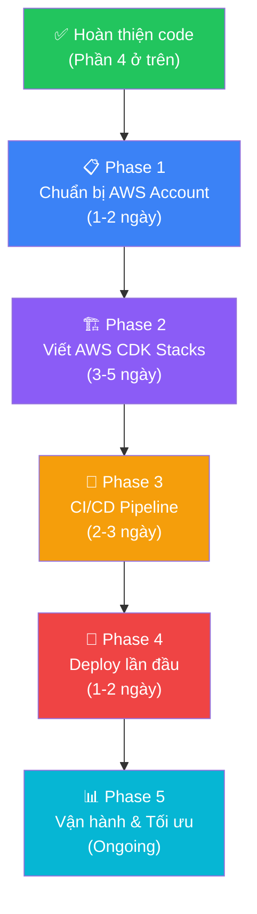

# 📊 Phân tích Dự án HCMUTE.OnlineJudge — Hoàn thiện phần mềm trước khi lên AWS

---

## 1. Đánh giá chi tiết từng Use Case so với đặc tả

### Bảng tổng hợp: Đặc tả vs Thực tế code

| UC | Tên | Backend | Frontend (Template) | Đánh giá |
|----|-----|---------|---------------------|----------|
| UC-01 | Đăng nhập / Đăng xuất | ✅ `users/router.py` — login, logout, session cookie | ✅ `auth/login.html` | ⚠️ **Hoạt động, nhưng chưa dùng Cognito** (dùng bcrypt tự quản). Đặc tả yêu cầu Cognito JWT. |
| UC-02 | Quản lý tài khoản cá nhân | ✅ `users/profile_router.py` — xem profile, thống kê AC | ✅ `auth/me.html`, `users/profile.html` | ✅ Hoàn thành |
| UC-10 | Tạo / Sửa / Xóa lớp | ✅ CRUD đầy đủ trong `courses/service.py` + `router.py` | ✅ `courses/list.html`, `form.html`, `detail.html` | ✅ Hoàn thành |
| UC-11 | Import sinh viên CSV/Excel | ✅ `courses/router.py` | ✅ `courses/detail.html` | ✅ Hoàn thành |
| UC-12 | Thêm / Xóa sinh viên thủ công | ✅ `invite_member()`, `remove_member()` trong router | ✅ Trong `courses/detail.html` | ✅ Hoàn thành |
| UC-13 | Sinh viên join lớp bằng mã mời | ✅ Endpoint `join_course_by_code` | ✅ Có form nhập mã mời | ✅ Hoàn thành |
| UC-20 | Tạo / Sửa / Xóa Problem | ✅ CRUD đầy đủ trong `problems/` | ✅ `problems/list.html`, `form.html`, `detail.html` | ✅ Hoàn thành |
| UC-21 | Upload Testcase | ✅ CRUD testcase trong `testcases/` | ✅ `testcases/form.html`, `list.html` | ⚠️ Hoạt động (từng cặp), **chưa hỗ trợ upload ZIP** |
| UC-22 | Cấu hình giới hạn time/memory | ✅ `time_limit_ms`, `memory_limit_kb` trong Problem model | ✅ Trong `problems/form.html` | ✅ Hoàn thành |
| UC-23 | Xem đề bài | ✅ `problems/detail.html` render Markdown | ✅ Template có Markdown render | ✅ Hoàn thành |
| UC-30 | Tạo Contest | ✅ CRUD đầy đủ + mật khẩu bảo mật | ✅ `contests/form.html` | ✅ Hoàn thành |
| UC-31 | Gán Problem vào Contest | ✅ `assign_problem()`, `unassign_problem()` | ✅ Trong `contests/detail.html` | ✅ Hoàn thành |
| UC-32 | Tham gia Contest | ✅ Xác thực mật khẩu khi đăng ký | ✅ Nút Register trong detail có ô nhập mật khẩu | ✅ Hoàn thành |
| UC-33 | Nộp Submission | ✅ Đã gắn submission với `contest_id` | ✅ Form truyền `contest_id` | ✅ Hoàn thành |
| UC-40→42 | Chấm bài tự động | ✅ Judge Worker hoàn chỉnh: SQS poll → compile → run → verdict | N/A (background service) | ✅ Hoàn thành cơ bản |
| UC-50 | Xem kết quả Submission | ✅ `submission_detail()`, HTMX polling | ✅ `submissions/detail.html`, `_status.html` | ✅ Hoàn thành |
| UC-51 | Xem Leaderboard | ✅ `LeaderboardService.compute()` — ICPC + IOI scoring | ✅ `contests/leaderboard.html`, `_leaderboard.html` (HTMX poll 5s) | ✅ Hoàn thành |
| UC-52 | Xuất bảng điểm Excel/CSV | ✅ Endpoint export CSV | ✅ Nút "Xuất điểm" | ✅ Hoàn thành |
| UC-53 | Dashboard Analytics | ❌ **Chưa có** | ❌ **Trang chủ redirect thẳng /problems** | 🟡 Nice-to-have |

---

## 2. Phân tích chi tiết các phần THIẾU

### 🔴 Mức Quan trọng (Must-have theo đặc tả)

#### 2.1. Ngôn ngữ lập trình — chỉ có C++ và Python

**Hiện trạng code:**
- `Language` enum (`submissions/models.py`): chỉ có `CPP = "cpp"` và `PYTHON = "python"`
- Judge Worker `languages/__init__.py`: chỉ có spec cho C++17 và Python 3
- **Đặc tả yêu cầu**: C, C++, Java, Python 3 (tối thiểu)

**Cần làm:**
- [x] Backend: Thêm `C = "c"` và `JAVA = "java"` vào `Language` enum
- [x] Backend: Thêm `LanguageSpec` cho C (gcc) và Java (javac/java) trong judge-worker
- [x] Backend: Tạo Alembic migration cập nhật enum
- [x] Backend: Cài `default-jdk` trong judge-worker Dockerfile
- [x] Frontend: Cập nhật dropdown ngôn ngữ trên form submit

---

#### 2.2. Import sinh viên từ CSV/Excel (UC-11)

**Hiện trạng**: Hoàn toàn chưa có code.

**Cần làm:**
- [x] Backend: Endpoint `POST /courses/{id}/import-students` nhận file upload
- [x] Backend: Service parse CSV (cột: mssv, email, họ tên) → tạo User nếu chưa tồn tại → enroll vào course
- [x] Backend: Xử lý ngoại lệ (email trùng → log báo cáo)
- [x] Frontend: Template `courses/import.html` — form upload file + hiển thị kết quả (thành công/lỗi)

---

#### 2.3. Sinh viên join lớp bằng mã mời (UC-13)

**Hiện trạng**: Hoàn toàn chưa có.
- Course model (`courses/models.py`) **không có field `invite_code`** (ERD ban đầu có `invite_code UK` nhưng code chưa implement)
- Không có endpoint để sinh viên tự join bằng mã mời

**Cần làm:**
- [x] Backend: Thêm `invite_code` vào Course model (auto-generate khi tạo course)
- [x] Backend: Migration thêm cột `invite_code` (unique)
- [x] Backend: Endpoint `POST /courses/join` nhận `invite_code` → enroll user
- [x] Frontend: Trang/modal cho sinh viên nhập mã mời

---

#### 2.4. Xuất bảng điểm Excel/CSV (UC-52)

**Hiện trạng**: Không có code nào liên quan đến export.

**Cần làm:**
- [x] Backend: Endpoint `GET /courses/{id}/export` và `GET /contests/{id}/export`
- [x] Backend: Service query tổng hợp điểm → generate Excel/CSV (dùng `openpyxl` hoặc csv builtin)
- [x] Backend: Thêm `openpyxl` vào dependencies (nếu có)
- [x] Frontend: Nút "Xuất điểm" trên `courses/detail.html` và `contests/detail.html`

---

#### 2.5. Submission chưa gắn với Contest

**Hiện trạng**: ERD đặc tả ghi `Submission` có `contest_id FK`, nhưng code thực tế:
- Submission model (`submissions/models.py`): **Không có `contest_id`**
- Submit form không nhận `contest_id`
- Leaderboard query dùng `problem_id IN (...)` + time window — workaround tạm, **không chính xác** khi cùng 1 bài xuất hiện trong nhiều contest

**Cần làm:**
- [x] Backend: Thêm `contest_id` (FK, nullable) vào Submission model
- [x] Backend: Migration thêm cột
- [x] Backend: Cập nhật submit flow — nếu nộp từ contest thì gắn `contest_id`
- [x] Backend: Cập nhật leaderboard query filter theo `contest_id`
- [x] Frontend: Form nộp bài trong contest context phải truyền `contest_id`

---

#### 2.6. Quên mật khẩu (Forgot Password)

**Hiện trạng**: Không có flow reset password.

**Cần làm:**
- [ ] Backend: Endpoint `POST /auth/forgot-password` → generate token, gửi email (hoặc hiển thị link)
- [ ] Backend: Endpoint `POST /auth/reset-password` → verify token, đổi password
- [ ] Frontend: Template `auth/forgot_password.html`, `auth/reset_password.html`

> **Lưu ý:** Nếu quyết định dùng Cognito, flow này tự động có qua Hosted UI — không cần tự code.

---

#### 2.7. Mật khẩu Contest (UC-30)

**Hiện trạng**: Đặc tả ghi "Tạo Contest với thời gian và mật khẩu", nhưng code chỉ có `visibility` (public/private) + `ContestRegistration`. Không có trường `password_hash` trong Contest model.

**Cần làm:**
- [x] Backend: Thêm `password_hash` (nullable) vào Contest model
- [x] Backend: Khi student register contest, nếu contest có password → kiểm tra password
- [x] Frontend: Input password trên form tạo contest + form đăng ký contest

---

### 🟡 Mức Trung bình

#### 2.8. Upload Testcase dạng ZIP

**Hiện trạng**: Testcase upload từng cặp input/output. Đặc tả ghi "upload zip".

**Cần làm:**
- [ ] Backend: Nhận file ZIP → extract → parse các cặp `*.in` / `*.out`
- [ ] Frontend: Chấp nhận `.zip` trên form upload

---

#### 2.9. Redis Leaderboard Cache

**Hiện trạng**: Redis config có trong `config.py` nhưng leaderboard `compute()` query DB trực tiếp mỗi request.

**Cần làm (khi scale):**
- [ ] Backend: Cache leaderboard result vào Redis, invalidate khi có verdict mới

---

#### 2.10. Trường `student_code` (MSSV) trong User

**Hiện trạng**: ERD đặc tả có `student_code`, nhưng User model (`users/models.py`) **không có field `student_code`**.

**Cần làm:**
- [x] Backend: Thêm `student_code` vào User model
- [x] Frontend: Thêm trường MSSV trên form đăng ký và profile

---

---

#### 2.11. Chuẩn bị Hạ tầng AWS (Infrastructure as Code)

**Hiện trạng**: Toàn bộ ứng dụng đang chạy ở Local bằng Docker Compose. Cần chuyển đổi sang các dịch vụ Managed của AWS để đảm bảo tính sẵn sàng cao, bảo mật và dễ dàng mở rộng.

**Cần làm (AWS CDK):**
- [ ] **Auth (Amazon Cognito)**: 
  - Thay thế hệ thống JWT tự build hiện tại bằng Cognito User Pool.
  - Cập nhật backend FastAPI để verify JWT Token từ Cognito thay vì tự check DB.
  - Dùng Hosted UI của Cognito cho luồng Login / Register / Forgot Password.
- [ ] **Data (Amazon RDS & ElastiCache)**: 
  - Triển khai Aurora PostgreSQL Serverless v2 thay cho Postgres local.
  - Triển khai ElastiCache (Redis) cho Leaderboard caching.
- [ ] **Storage & Messaging (Amazon S3 & SQS)**:
  - Tạo S3 Bucket cho Submissions và Testcases.
  - Tạo SQS Queue (kèm Dead-letter Queue) cho Judge Worker.
- [ ] **Compute (AWS Fargate & Lambda)**:
  - Web Backend: Đóng gói FastAPI thành Docker chạy trên ECS Fargate hoặc Lambda (qua Mangum).
  - Judge Worker: Đóng gói thành Docker Container chạy trên ECS Fargate liên tục poll SQS.

## 3. Tổng kết: Code đã hoàn thành bao nhiêu %

```
██████████████████████░░ ~90% hoàn thành
```

| Mảng | Đã xong | Cần làm thêm |
|------|---------|--------------|
| **Backend Business Logic** | ~95% | Forgot password |
| **Frontend Templates** | ~95% | Forgot password, Dashboard |
| **Judge Worker** | ~95% | Upload testcase ZIP |
| **Database Schema** | 100% | Đã cập nhật đủ cột cho các tính năng trên |
| **Testing** | ~30% | Unit tests, E2E test, load test |
| **AWS Infrastructure** | 0% | Hoàn toàn chưa bắt đầu |

---

## 4. Phân công cho nhóm 2 người — Hoàn thiện phần mềm

### 👤 Người A — Backend Developer

Tập trung vào: **API endpoints, business logic, database, judge worker**

#### Tuần 1: Sửa data model + migration

| # | Task | File cần sửa | Ưu tiên |
|---|------|-------------|---------|
| 1 | Thêm `student_code` vào User model | `users/models.py`, migration | ✅ |
| 2 | Thêm `invite_code` vào Course model + auto-generate | `courses/models.py`, `courses/service.py`, migration | ✅ |
| 3 | Thêm `contest_id` (FK nullable) vào Submission model | `submissions/models.py`, migration | ✅ |
| 4 | Thêm `password_hash` vào Contest model | `contests/models.py`, migration | ✅ |
| 5 | Thêm `C = "c"`, `JAVA = "java"` vào Language enum | `submissions/models.py`, migration | ✅ |

#### Tuần 2: Implement tính năng Backend

| # | Task | File cần tạo/sửa | Tình trạng |
|---|------|------------------|------------|
| 6 | Endpoint join lớp bằng `invite_code` | `courses/router.py`, `courses/service.py` | ✅ |
| 7 | Endpoint import CSV sinh viên | `courses/router.py`, `courses/service.py` (thêm `openpyxl`) | ✅ |
| 8 | Endpoint xuất bảng điểm Excel/CSV | `courses/router.py` hoặc tạo `courses/export.py` | ✅ |
| 9 | Cập nhật submit flow gắn `contest_id` | `submissions/router.py`, `submissions/service.py` | ✅ |
| 10 | Contest password flow | `contests/service.py`, `contests/router.py` | ✅ |

#### Tuần 3: Judge Worker + Testing

| # | Task | File | Tình trạng |
|---|------|------|------------|
| 11 | Thêm LanguageSpec cho C, Java | `judge-worker/worker/languages/__init__.py` | ✅ |
| 12 | Cập nhật Dockerfile cài `gcc`, `default-jdk` | `judge-worker/Dockerfile` | ✅ |
| 13 | Upload testcase ZIP (extract + parse) | `testcases/router.py`, `testcases/service.py` | 🔴 |
| 14 | Unit test cho modules: problems, contests, testcases | `tests/` | 🔴 |
| 15 | Cập nhật leaderboard query dùng `contest_id` | `contests/leaderboard.py` | ✅ |

---

### 👤 Người B — Frontend Developer

Tập trung vào: **Jinja2 templates, HTMX interaction, UX, testing**

#### Tuần 1: UI cho tính năng mới

| # | Task | File cần tạo/sửa |
|---|------|------------------|
| 1 | Form đăng ký thêm trường MSSV | `auth/register.html` | ✅ |
| 2 | UI join lớp bằng mã mời | Tạo `courses/join.html` hoặc modal trên `courses/list.html` | ✅ |
| 3 | Hiển thị invite_code trên trang chi tiết lớp (cho Educator) | `courses/detail.html` | ✅ |
| 4 | Form upload CSV sinh viên + hiển thị kết quả | Tạo `courses/import.html` | ✅ |
| 5 | Nút "Xuất bảng điểm" trên trang lớp/contest | `courses/detail.html`, `contests/detail.html` | ✅ |

#### Tuần 2: Contest + Submission UI

| # | Task | File | Tình trạng |
|---|------|------|------------|
| 6 | Form tạo contest thêm trường password | `contests/form.html` | ✅ |
| 7 | Form đăng ký contest nhập password | `contests/detail.html` (register section) | ✅ |
| 8 | **Nộp bài trong contest**: form submit nhận `contest_id` | Sửa `submissions/form.html` | ✅ |
| 9 | Dropdown chọn ngôn ngữ (C, C++, Java, Python) | `submissions/form.html` | ✅ |
| 10 | Trang forgot password / reset password | Tạo `auth/forgot_password.html`, `auth/reset_password.html` | 🔴 |

#### Tuần 3: Polish + Testing

| # | Task | File | Tình trạng |
|---|------|------|------------|
| 11 | Trang Dashboard cho Educator | Tạo `templates/dashboard.html` | 🔴 |
| 12 | Error pages: 403, 500 | Tạo `errors/403.html`, `errors/500.html` | 🔴 |
| 13 | Responsive design + mobile-friendly | Sửa tất cả templates | 🔴 |
| 14 | E2E test Playwright | `tests/e2e/` | 🔴 |
| 15 | Cập nhật profile hiển thị MSSV | `users/profile.html`, `auth/me.html` | ✅ |

---

## 5. Sau khi hoàn thiện phần mềm → Lên AWS

> **QUAN TRỌNG:** Hoàn thành TẤT CẢ các task ở Phần 4 trước, đảm bảo phần mềm chạy ổn trên local (Docker Compose) rồi mới bắt tay vào AWS.

### Bước tiếp theo khi code xong:



#### Phase 1: Chuẩn bị AWS (1-2 ngày)
- Tạo AWS Account, bật MFA, tạo IAM Admin User
- Cài `aws-cli` + `aws-cdk` CLI
- `cdk bootstrap` cho region `ap-southeast-1`

#### Phase 2: Viết CDK Stacks (3-5 ngày)
Tạo thư mục `infra/cdk/` với 6 stacks:

| Stack | Tài nguyên AWS | Ai phụ trách |
|-------|---------------|-------------|
| **NetworkStack** | VPC, Subnets, Security Groups | Người A |
| **AuthStack** | Cognito User Pool + App Client | Người B |
| **DataStack** | RDS Aurora Serverless v2, ElastiCache Redis, S3 buckets, SQS + DLQ, Secrets Manager | Người A |
| **ComputeStack** | Lambda (FastAPI Mangum), API Gateway, ECS Fargate (Judge Worker), ECR | Người A |
| **EdgeStack** | CloudFront, Route 53, ACM Certificate | Người B |
| **ObservabilityStack** | CloudWatch Alarms, X-Ray | Người B |

#### Phase 3: CI/CD (2-3 ngày)
- GitHub Actions: Build → Test → Push ECR → CDK Deploy
- Staging environment trước, Production sau

#### Phase 4: Deploy lần đầu (1-2 ngày)
```
cdk deploy NetworkStack → AuthStack → DataStack → ComputeStack → EdgeStack → ObservabilityStack
```
- Chạy Alembic migration trên RDS
- Seed dữ liệu mẫu
- Smoke test toàn bộ flow

#### Phase 5: Vận hành (ongoing)
- Monitor chi phí (AWS Cost Explorer, budget ~$40-80/tháng)
- Nâng cấp sandbox lên `isolate` trên Fargate
- Tối ưu Lambda cold start
- Fargate auto-scaling theo SQS queue depth

---

## 6. Checklist ưu tiên tổng hợp

### 🔴 Phải làm xong trước khi lên AWS

- [x] Thêm ngôn ngữ C, Java (backend + judge worker + frontend)
- [x] `invite_code` trên Course + endpoint join
- [x] `contest_id` trên Submission + cập nhật luồng submit/leaderboard
- [x] Import CSV sinh viên
- [x] Xuất bảng điểm Excel/CSV
- [x] `student_code` (MSSV) trên User
- [x] Contest password
- [ ] Forgot password flow

### 🟡 Nên làm (nhưng có thể làm song song với AWS)

- [ ] Upload testcase ZIP
- [ ] Redis leaderboard cache
- [ ] Dashboard Educator
- [ ] Error pages (403, 500)
- [ ] E2E test
- [ ] Responsive mobile UI

### ☁️ Chuẩn bị hạ tầng AWS (Deployment)

- [ ] **Auth**: Cấu hình Cognito User Pool & Tích hợp vào Web App
- [ ] **Database**: Thiết lập RDS Aurora PostgreSQL Serverless v2
- [ ] **Storage & Queue**: Khởi tạo S3 Buckets & SQS Queues
- [ ] **Compute (Web)**: Viết CDK deploy FastAPI lên AWS Lambda / Fargate
- [ ] **Compute (Worker)**: Viết CDK deploy Judge Worker lên ECS Fargate
- [ ] **CI/CD**: Xây dựng luồng GitHub Actions tự động build & deploy
